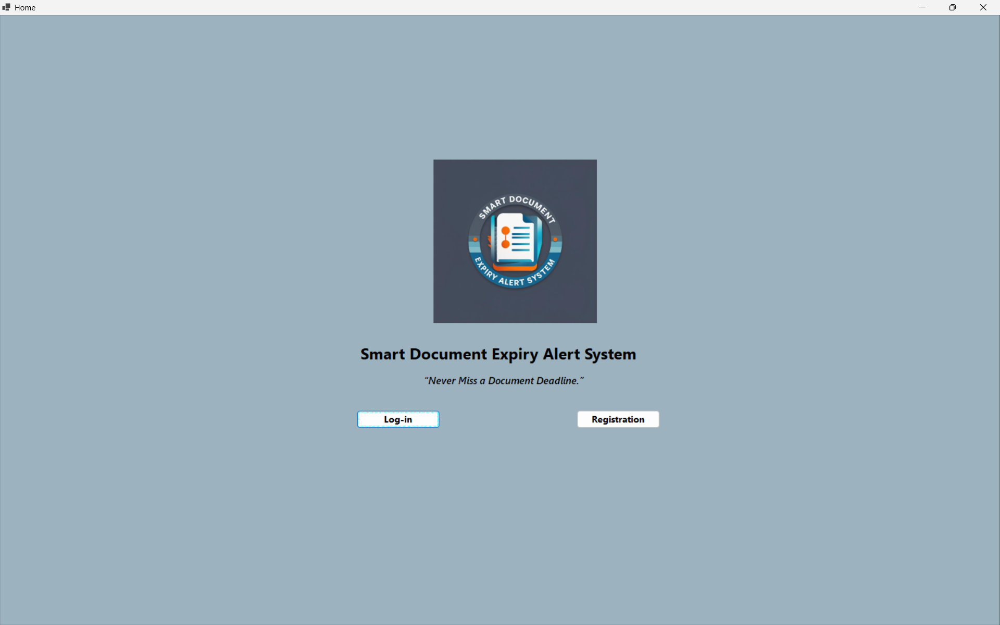
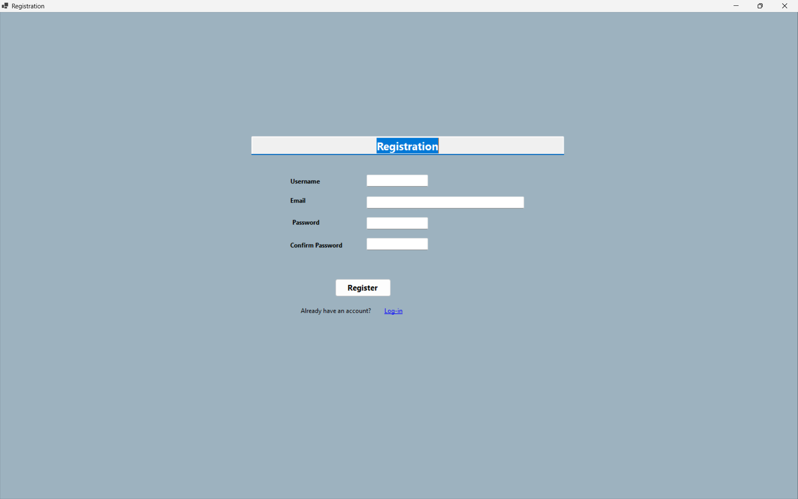
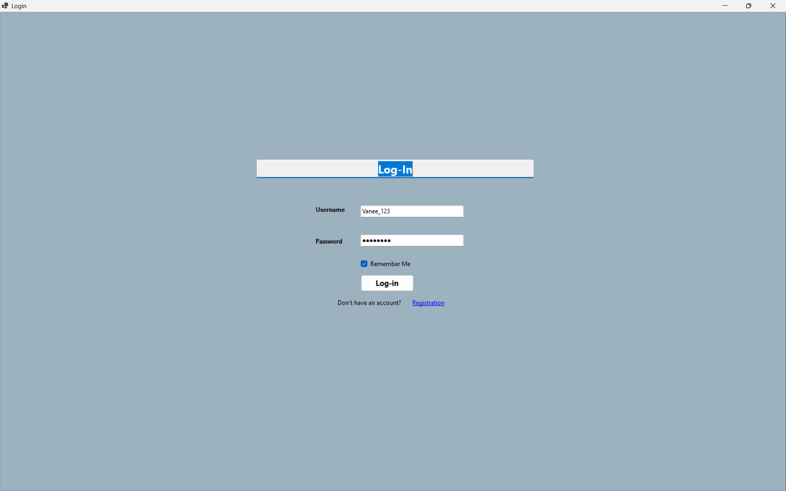
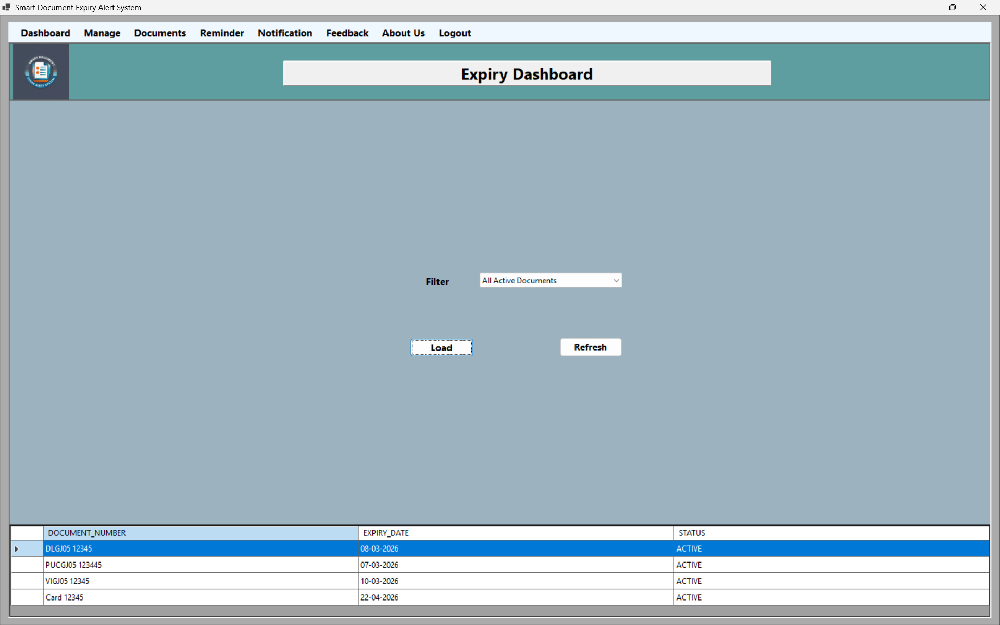
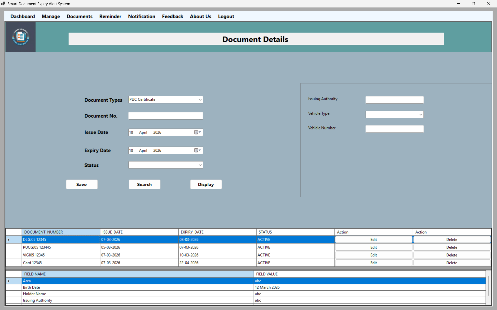
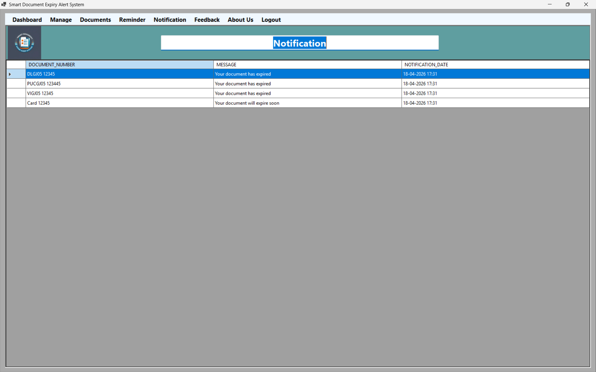

# Smart Document Expiry Alert System

A C# Windows Forms application to manage documents and track expiry dates with reminders.

A desktop-based system to efficiently manage documents and track expiry with automated reminders.

## Features
- Document management
- Expiry tracking dashboard
- Reminder system
- Notification system

## Tech Stack
- C#
- Windows Forms
- Oracle Database

## Author
Developed by Jeel Panchal

## Screenshots

### Home

### Registration

### Login

### Expiry Dashboard

### Documents

### Notifications

